# S15 Assignment

I applied the following strategy in attempt to solve the assignment

1. **Create a DataSet and DataLoader for our new dataset**. Since we have to experiment with small sizes initially, I implemented data loader to allow for an intended image size as output and also customize the fraction of dataset to take and also the train test split.
2. **Use Tensorboard**. Learnt to use TensorBoard with Pytorch. Had to write a separate module in library to use tensorboard to output the Training outcomes instead of json files used earlier.
3. **Separate Network from Loss criterion**. As earlier we already have create modular library, I separated the loss function from the Network definition, so loss functions can now be easily interchanged.

The above process took good 10-12 hours to learn, debug and get it right. For example Albumentations would return gray scale images transposed, a wierd inplace error for gradient calculation asking to change x += out to x = x + out and so on.

## First Experiment

**GOAL**: Intent was to keep the network really small and see what is working and what is not. At the same time challenge was to get enough receptive field and keep the output having same dimension as the input.

**NETWORK**: Started with following network. It has around **230K parameters**. We trained on **32K images** and tested on **8K images** per epoch with a **batch size of 256**. It took around **3 minutes per epoch**. We used **L1 Loss with reduction of "sum"** instead of mean to avoid a division. **Learning rate was 0.0002** which I found with a simple LR finder over 3 epochs. 

The loss came down from 300K to 230K and there were no signs of overfitting. Test loss was similar to train loss.

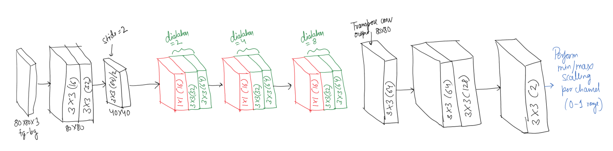

### INPUTS

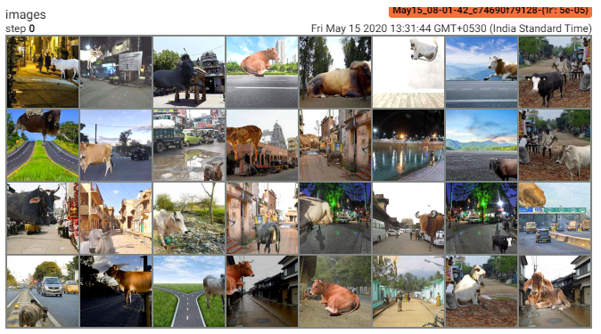

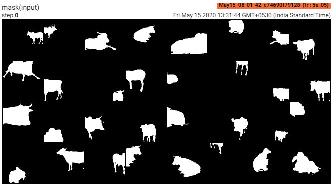

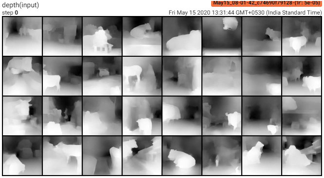

### Outcomes

#### TRaining Loss
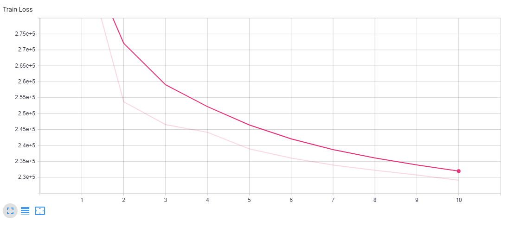

##### Test Loss
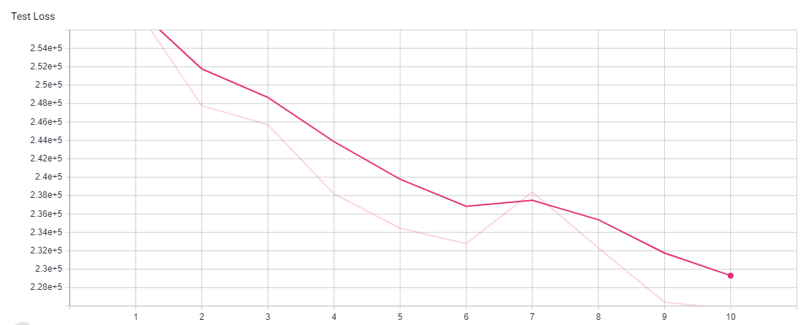

I found that the network had too much **checker board** issue and was not training that well so I updated it as below. I reduced amount of dilation in atrous convolutions and replaced transposed conv with pixel shuffle. The resulting netowrk improved further. Traned for 20 epochs with LR of 0.0002 and another 10 epochs with LR of 0.00002. Results can be seen below. The loss did not decrease beyond 125K though.

### Updated Network

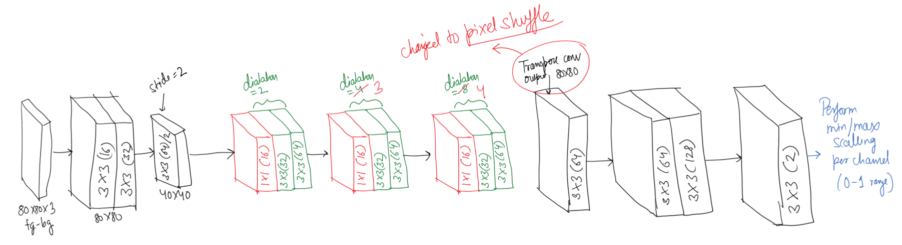

### Outcomes

#### TRaining Loss
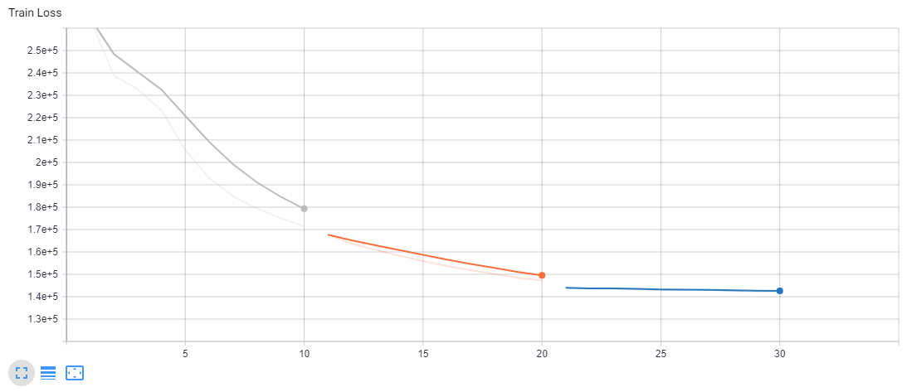

#### Test Loss
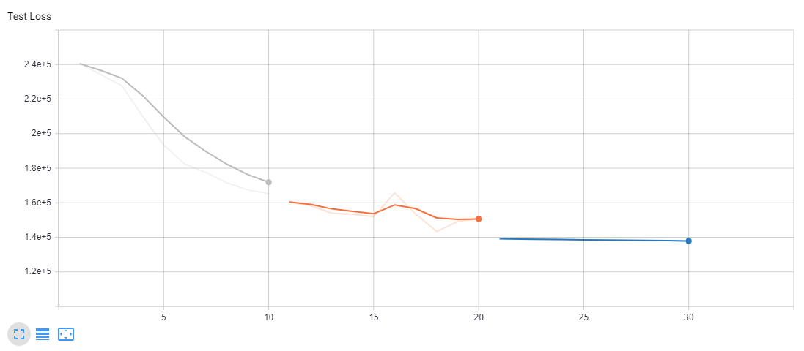

#### Results 

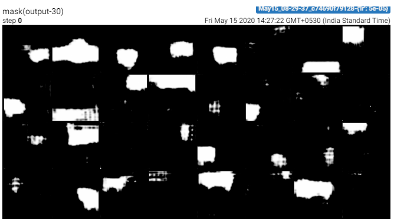

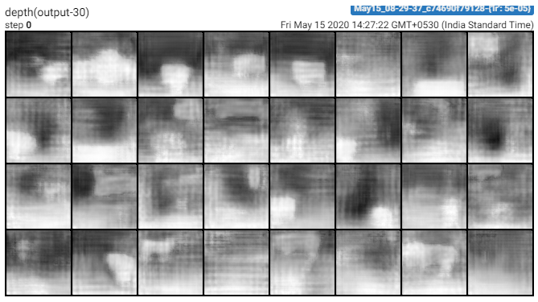

### Doubling the Features?
Tried same network as above with double the number of channels in each layer, but the outcome was not even close. My guess is that increasing the channels confused the system as the data being passed is lowres. You need more input data to work with more channels. It is just like in a Logistic Regression, adding more features is not always helpful.

## Using MSELOSS with mean and not sum
This gave a lot better results after 35 epochs of training, beyond whch it did not show promise to train further as shown below. At this point I want to try some more loss functions before trying to modify our network (encoder decoder architectures, Resnet type variants etc.) and/or the way we create the imges (e.g. thresholding, quantization, etc.)

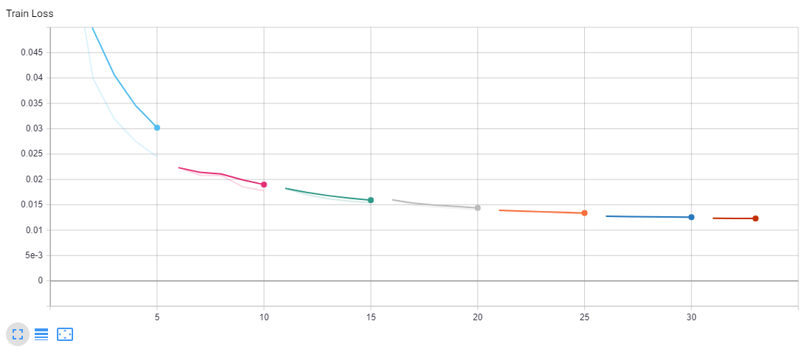

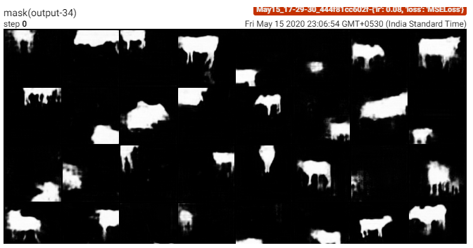

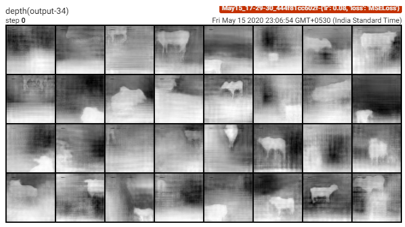

## Next Iteration - Deeper Network - No Atrous - Use Depthwise Separation

