# S15 Assignment

## Problem Statement:
Given depth, foreground and foreground-background images. Train a DNN to detect the forground mask and depth from the foreground background image. We generated our own data of 400K images [here](https://github.com/abhinavdayal/EVA4/tree/master/S14).

## Approach

1. **Create a [DataSet and DataLoader](https://pytorch.org/tutorials/beginner/data_loading_tutorial.html) for serving our data**. The data loaded allows for image resizing and train test split. My implementation is [here](https://github.com/abhinavdayal/EVA4_LIBRARY/blob/master/EVA4/eva4datasets/fgbgdata.py). 
2. **Use Tensorboard**. User a run builder based on [this post](https://hackernoon.com/how-to-structure-a-pytorch-ml-project-with-google-colab-and-tensorboard-7ram3agi) but uses tensorboard magic in colab instead of ngrok method.
3. **Separate Network from Loss criterion**. Separated the loss function from the Network definition in library, so loss functions can now be easily interchanged. Losses experimented with: L1, MSE, BCE, Dice, SSIM, MSSSIM and their combinations. [This paper](https://arxiv.org/pdf/1812.11941.pdf) gave a good discussion and I also found combination of L1 and [MSSSIM](https://github.com/jorge-pessoa/pytorch-msssim/blob/master/pytorch_msssim/__init__.py) to work best. 
4. **Augmentations**: Added ability in dataset generator to apply transforms to both fgbg and intended outcome images. Used Blur, grayscale, rotate, horizontal flip, brightness contrast transforms and did not do cutouts as this is pixel level classification.
5. **LR Scheduler**: Used One Cycle Policy for initial training then cyclic LR with triangular 2 policy.
6. **Network Architectures**: Since the output of out network must be of same size as input, there are several possibilities, parallel with atrous convolutions and deconvolutions, or U (encoder/decoder) architectures. In order to keep parameter count relatively low, I considered use of atrous convolutions and use of strides to increase receptive fields quicker. For decoder I tried both transpose convolutions and pixel shuffle. The UNet based architectures worked really well. I started very conservatively though in order to use as less parameters and to do faster trainings.
7. Initial experimentation I did was on 10% data with 80-20 train test split. Each experiment took few minutes to try and 20-30 minutes to validate and go futher. For two such promising networks I did full training for 10 epochs minimum on entire dataset. For more promising network, I tried further training after modifyng the loss and transformations on the larger sized images.
8. As an input I **only passed fgbg image and not the background image**. As an output I planned to output 2 channels, one for the mask and other for the depth.
9. Finally I tried the network on samle 8 images that are real images and not generated images to see how the network is performing. The results were awesone.

**Time spent**: 25-30 hours total including coding, debugging, reading posts and papers, and watching the number crunching, documenting etc.

## First Experiment

**GOAL**: Intent was to keep the network really small and see what is working and what is not. At the same time challenge was to get enough receptive field and keep the output having same dimension as the input.

**NETWORK**: Started with [this](https://github.com/abhinavdayal/EVA4_LIBRARY/blob/master/EVA4/eva4models/s15net.py) network. It has around **230K parameters**. I trained on **32K images** and tested on **8K images** per epoch with a **batch size of 256**. It took around **3 minutes per epoch**. Used **L1 Loss with reduction of "sum"** instead of mean to avoid a division. **Learning rate was 0.0002** which I found with a simple LR finder over 3 epochs. **Receptive Field** is 120.

The loss came down from 300K to 230K and there were no signs of overfitting. Test loss was similar to train loss.


### INPUTS


### Results 


#### Training Loss


##### Test Loss


I found that the network had too much **checker board** issue and was not training that well so I updated it as below. I reduced amount of dilation in atrous convolutions and replaced transposed conv with pixel shuffle. The resulting netowrk improved further. Traned for 20 epochs with LR of 0.0002 and another 10 epochs with LR of 0.00002. Results can be seen below. The loss did not decrease beyond 125K though.

### Updated Network

I reduced dilation. **Receptive Field** is 80. Switched to pixel shuffle. Network has close to **730K parameters** and it can be found [here](https://github.com/abhinavdayal/EVA4_LIBRARY/blob/master/EVA4/eva4models/s15net2.py).


#### TRaining Loss


#### Test Loss


### Doubling the channles along the way?
Tried same network as above with double the number of channels in each layer, but the outcome was not even close. My guess is that increasing the channels confused the system as the data being passed is lowres. You need more input data to work with more channels. It is just like in a Logistic Regression, adding more features is not always helpful.

### Using MSELOSS with mean and not sum
This gave a lot better results after 35 epochs of training, beyond whch it did not show promise to train further as shown below. At this point I want to try some more loss functions before trying to modify our network (encoder decoder architectures, Resnet type variants etc.) and/or the way we create the imges (e.g. thresholding, quantization, etc.)

* [LINK to ipynb](https://github.com/abhinavdayal/DepthMask/blob/master/S15Assignment_attempt1.ipynb)

### Results


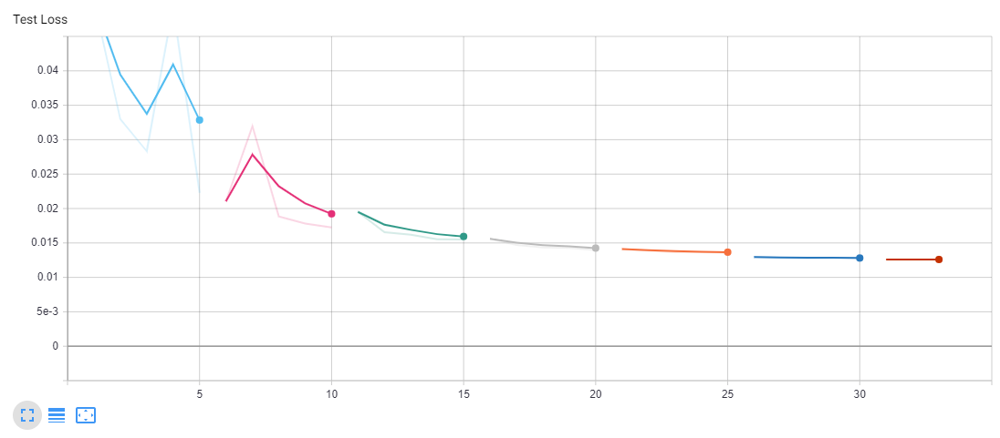


## USING SSIM Loss with window = 11 and reduction as mean
The depth calculation was much better. The MASKS however were almost blank images, so nothing to show. Notice how the checkerboard effect is gone and pixel shuffle is working way better with SSIM loss.

### Depth Output
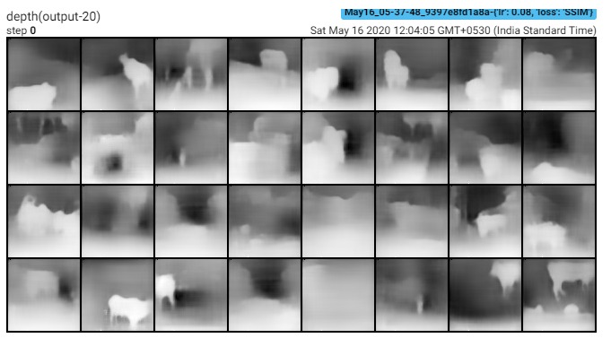
### Depth Input
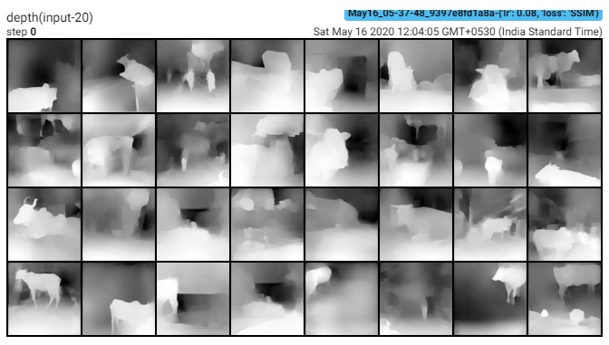

## Custom loss: using MSE for mask and SSIM for Depth

Till now I represented the problem as a reconstruction (regression) problem and for those these are the best losses. So why not use what worked well for each.

```
class CustomLoss(nn.Module):
    def __init__(self, maskloss, depthloss):
        super(CustomLoss, self).__init__()
        self.maskloss = maskloss
        self.depthloss = depthloss

    def forward(self, input, target):
        maskloss = self.maskloss(input[:,:1,:,:], target[:,:1,:,:])
        depthloss = self.depthloss(input[:,1:,:,:], target[:,1:,:,:])
        return maskloss + depthloss
```

Below, pink line indicates custom loss and blue indicates only SSIM. Both were trained for 20 epochs.

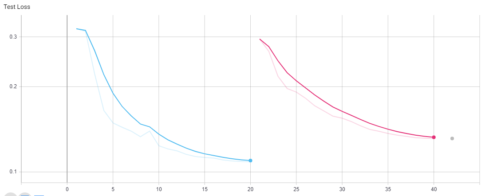

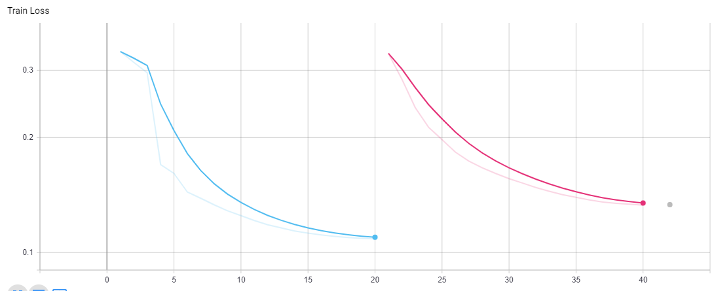

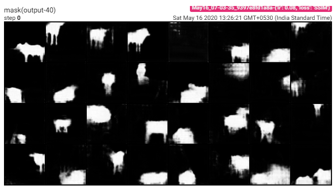
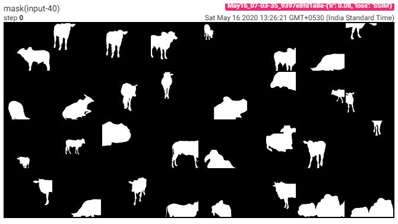

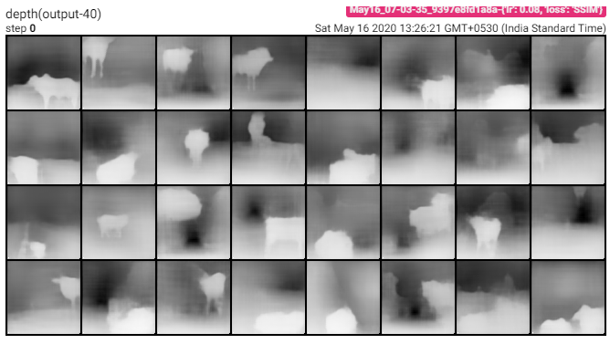
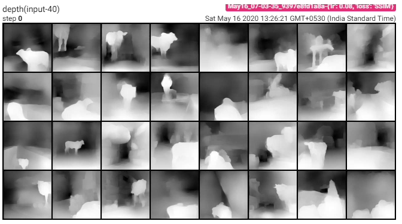

### LOSS VALUES

**Test loss at 10th EPOCH: .1549**

**Test loss at 20th EPOCH: .1312**


## DICE Loss for Mask and SSIM for Depth

DICE did not work so well for mask as shown below:

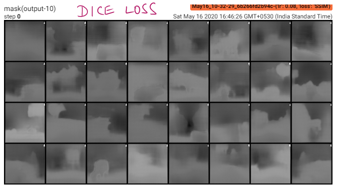

# Making residual blocks

I now added skip connections

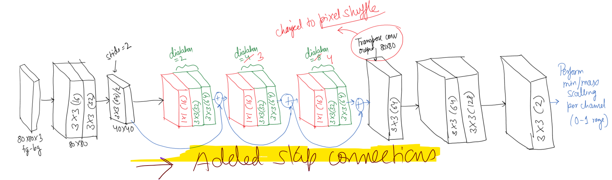

After training on this for 10 epochs below is the loss stats

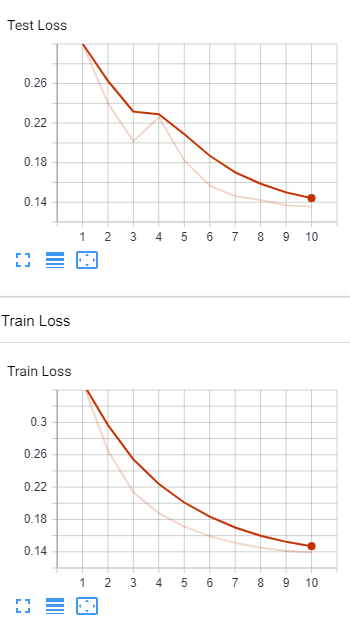

### Mask Outputs

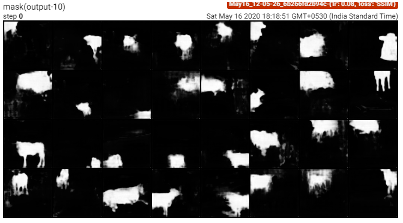
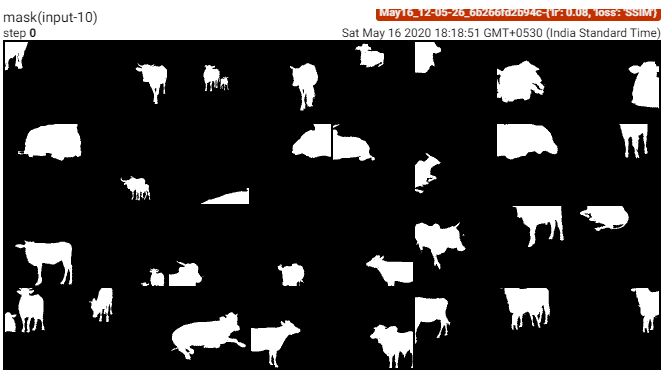

### Depth Outputs

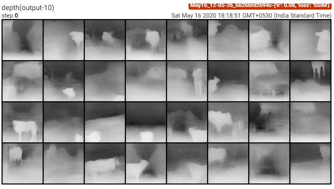
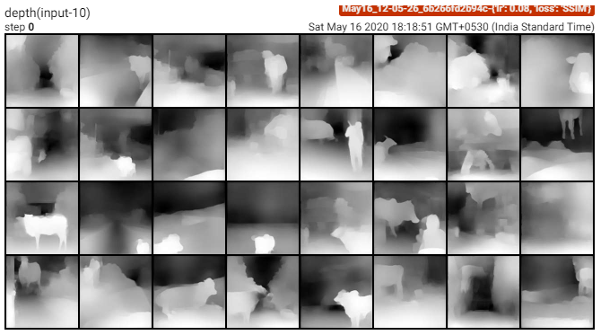

### LOSS VALUES

**Test loss at 10th EPOCH: .1355 (Without skip connections it was 0.1549)**

## Mixed Loss
Next based on [this paper](https://arxiv.org/pdf/1812.11941.pdf) I used MSSSIM loss along with L1. The losses code can be found [here](https://github.com/abhinavdayal/EVA4_LIBRARY/blob/master/EVA4/eva4losses.py).

Tried various combinations and finally used same figures as in this paper
Loss = 0.16 x L1 Loss + 0.84 x MSSSIS Loss

## Running on larger dataset

Ran for 4 epochs on the full dataset with the previous model (non resnet18) and got some decent results.
The loss reduced to 0.03x

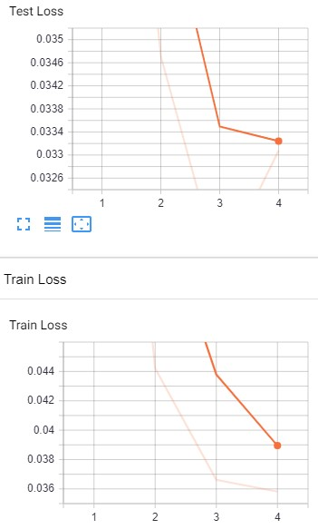
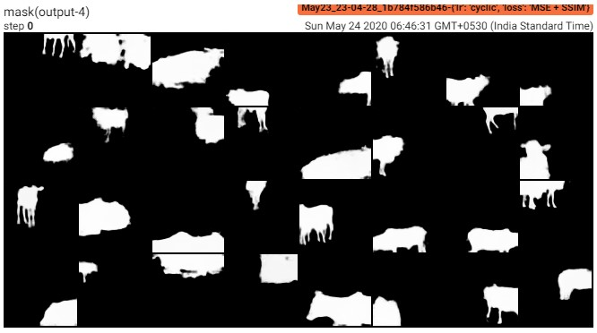
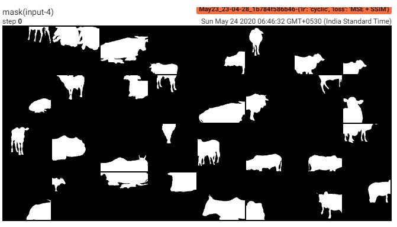
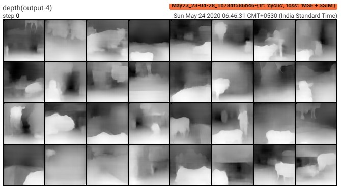
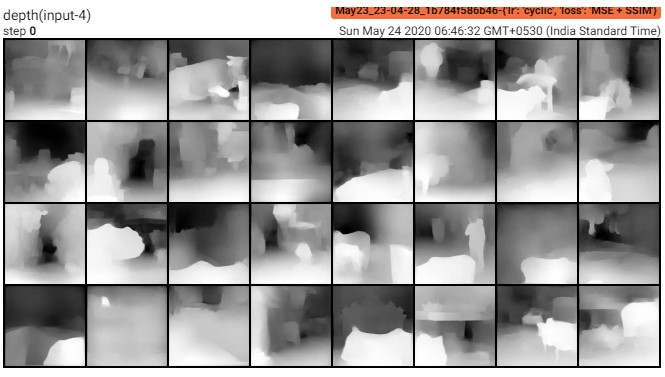

These images look good, however they only perform well on 80x80. I did not get time to tra on larger dataset as I wanted to try more architectures. But I also did not try because this one has inherent RF of 80 only. So had to increase the Receptive Fields.

# Encoder Decoder Archtecture with Resnet 18

The network is as shown below. This had 11M parameters and each batch took 7-8 seconds to train so very very slow. Only trioed on mini data (10%) with 80-20 train test split.

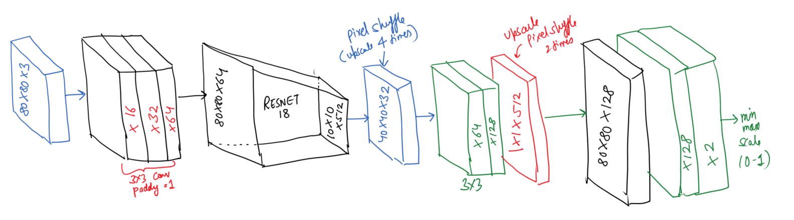

Outcomes with MSE loss for Mask and SSIM for Depth are shown below. There was no overfitting and test loss was consistently below train loss.

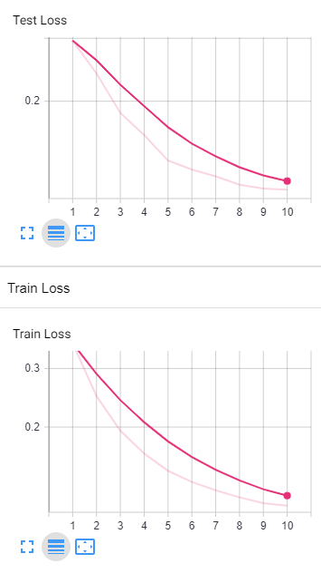

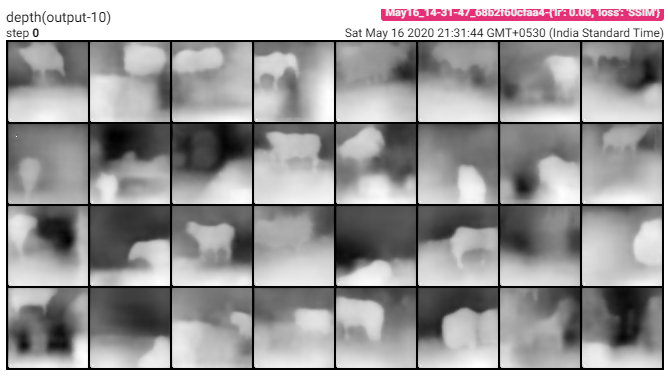
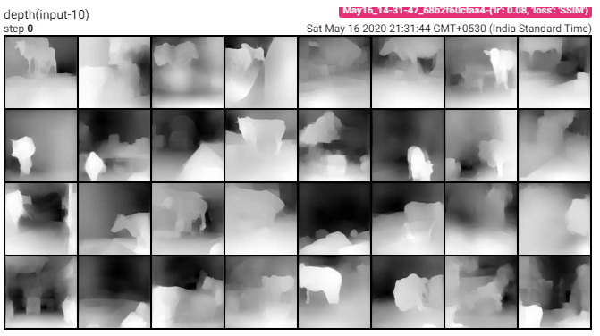

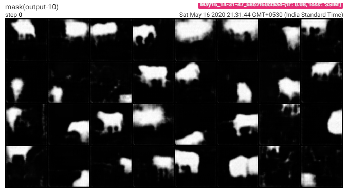
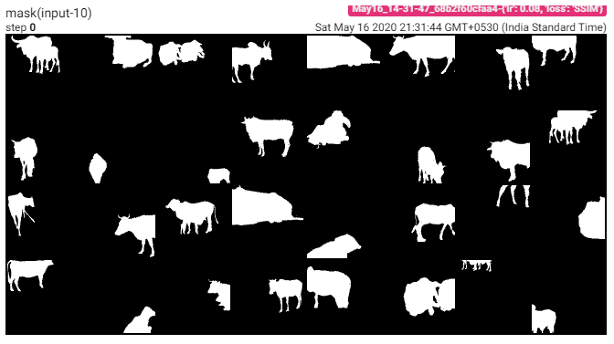

### LOSS VALUES

**Test loss at 10th EPOCH: .1131 (much better than 0.1355 value for previous network)**

# Augmentations
Tried few augmentations:
* blur - thought that the network must sharpen image to find sharp masks.
* random brightnesscontrast - to help learn in various such conditions
* rotate +/- 10 degrees only
* horizontal flip
* Tried grid distortion but initially it did not reduce loss that much so removed it and later did not try. Can be a promising think in this case.

To try any structural transform like rotate etc. I have to apply the same to mask and depth. So read about it and implemented that using Albumentations [here](https://github.com/abhinavdayal/EVA4_LIBRARY/blob/master/EVA4/eva4datasets/fgbgdata.py). Passing two list of transforms to dataset generator that will apply same transform from set1 to all images including mask and depth but only apply the second set of transforms to fgbg image. For example with blur, etc. we dont want to blur the mask and depth.

Below are sample augmentations
**NOTE**: I did not try cutouts etc. because this is a pixel level classification so every pixel is important. I model I can consider dropouts later if needed.

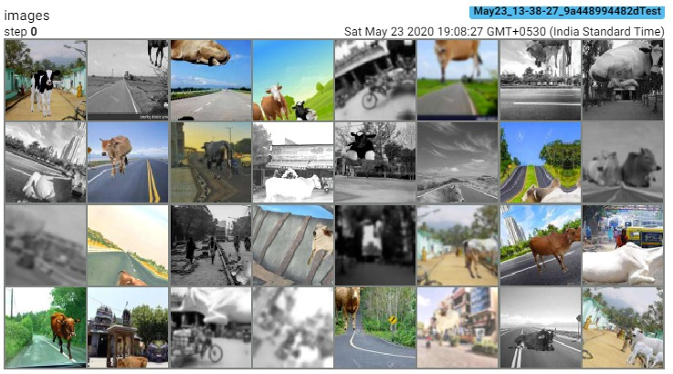
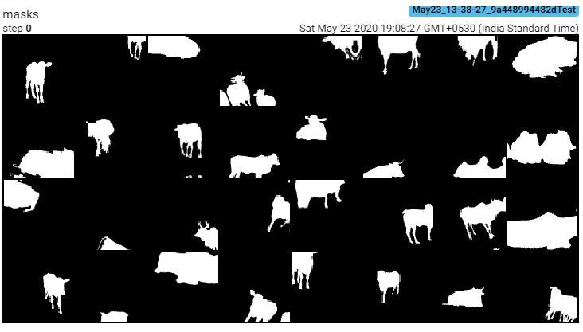
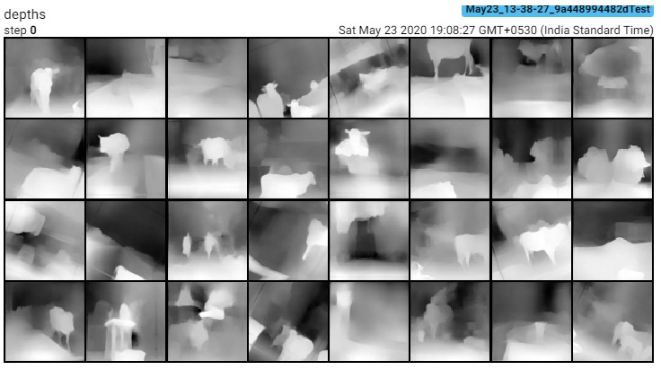

# Custom Encoder Decoder based on UNET concept
Reading literature and with group discussion I found that there is a lot of work on UNET based architectures in this domain. So it was worth trying. Few things I adjusted based on lessons learnt in classes. The network code is [here](https://github.com/abhinavdayal/EVA4_LIBRARY/blob/master/EVA4/eva4models/s15netED.py).

1. So I used concatenation instead of addition
2. used 1x1 wherever I have to only change number of channels to concatenate to produce desired channels
3. Retained pixel shuffle for pixel shuffle however, later I realize that transpose conv may be better because I am not putting that much additional convs on the skip connections. Or I should have used additions instead. But good learning!

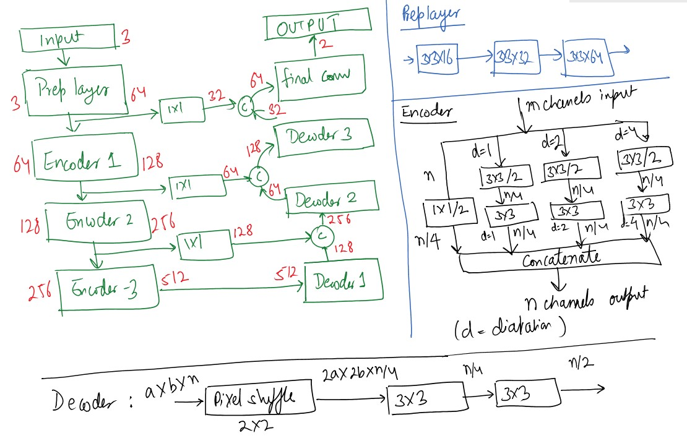

* [link to ipynb](https://github.com/abhinavdayal/DepthMask/blob/master/S15Assignment_4_MSSSIM.ipynb)
Trained for 10 epochs for 80x80 resolution with batch size of 192 that took 6 hours to complete. Then did 2 epochs on 160x160 size image that took another 4 hours to complete. The model had 2.3 million parameters overall. 

## Further refinements

### Larger size image training
Trained for 2 epochs on 160x60 sized data (5 hours)

### refining the loss
The range of loss in mask and depth channels is different and as the model trains the differnce increases. So I considered a provision to dynamically scale the mask loss to make it comparable to train loss. 

i.e. loss = factor x maskloss + depthloss

The factor is adaptively calculated based on the ration of depth to mask loss clamped from 1 to for max pre configured factor. Look at customloss and mixedloss definitions [here](https://github.com/abhinavdayal/EVA4_LIBRARY/blob/master/EVA4/eva4losses.py).

Trained for 1 epoch with hardher factor favoring the mask and for another 2 epocs with milder max factor of 4 (had to kill in middle in order to save time). But this time without any transformations. It saved 1/3rd of the time and network had already learnt to handle transformed images.

**Training times**
* 80x80 image 192 batch size, 1.42 it/sec
* 160x160 image with augmentations 80 batch size, 2.42 s/it
* 160x160 without augmentations 80 batch size, 1.81 s/it
* Trained for total 15 epochs.

## Final Results

#### Depth Outputs
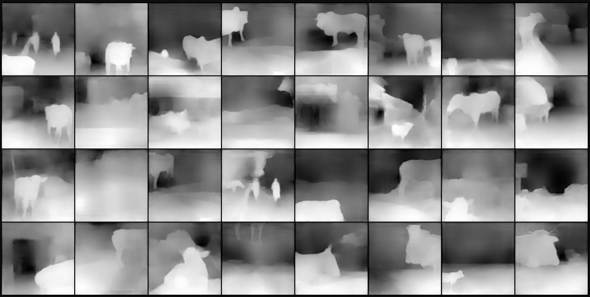
#### Depth Inputs
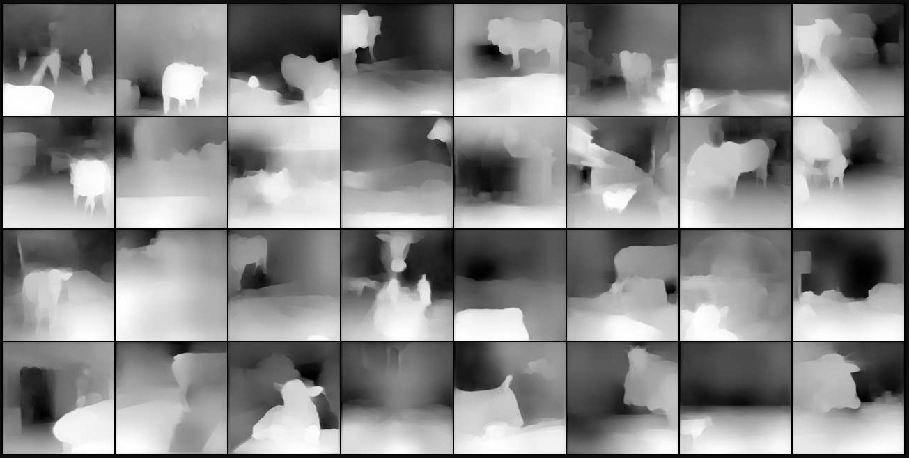
#### Difference in depths
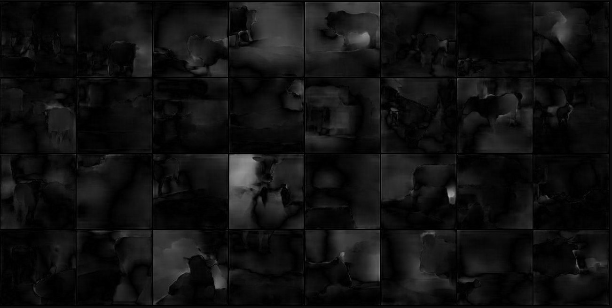
#### Mask Outputs
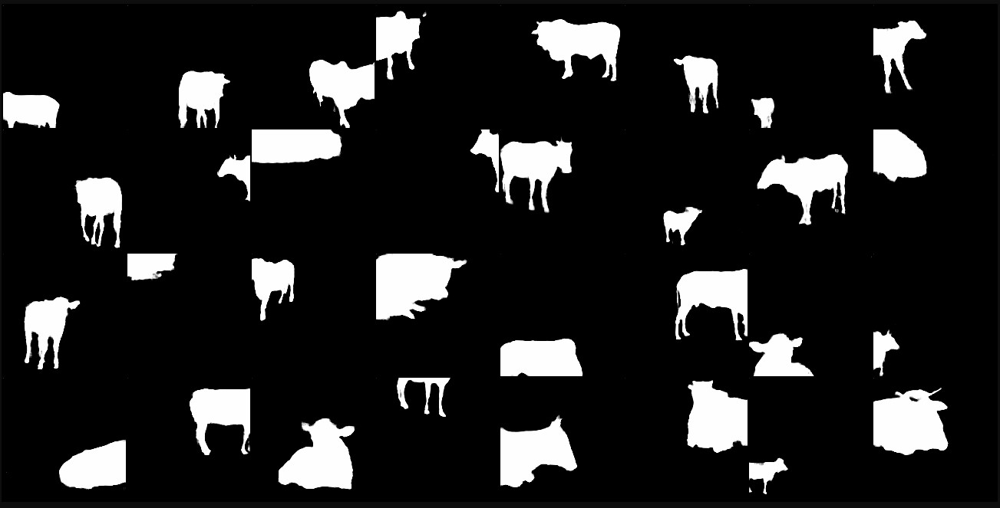
#### Mask Inputs
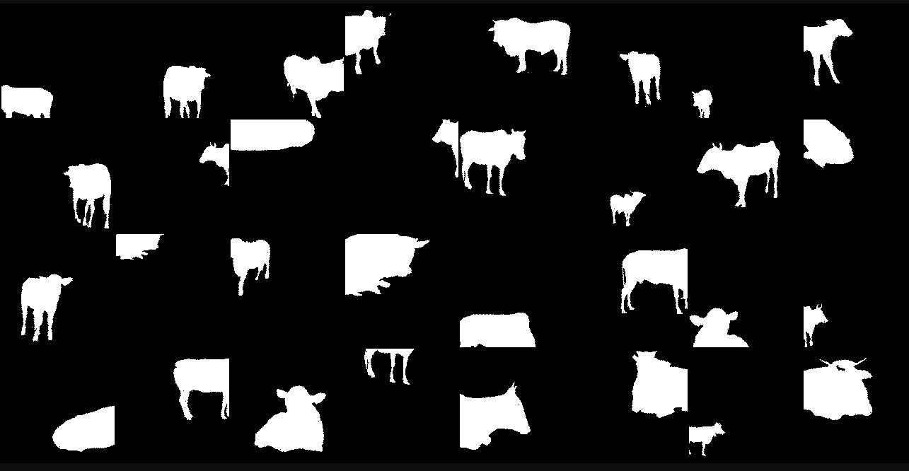
#### Difference in masks
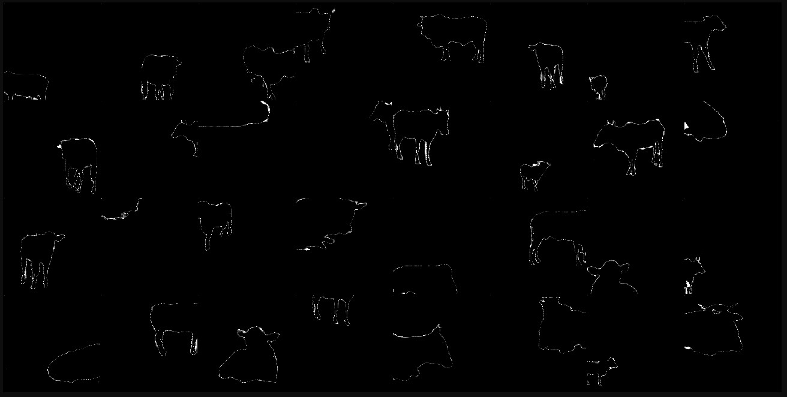
#### Learning rate and losses
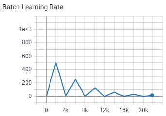
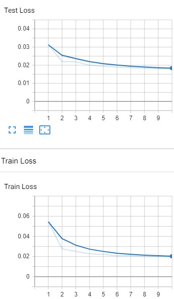


## Trying on unseen data
I tried it on 8 images that were not in our test/train dataset at all and some of them were very different from our dataset. Our group copllected these images. Below are the results. It is working well but can be improved (See conclusions).

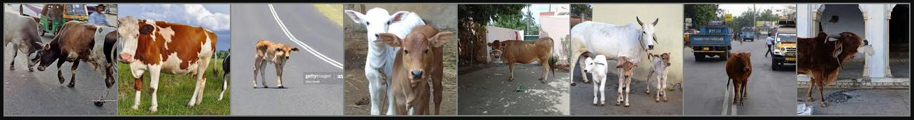
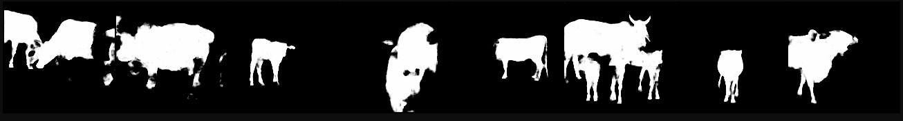
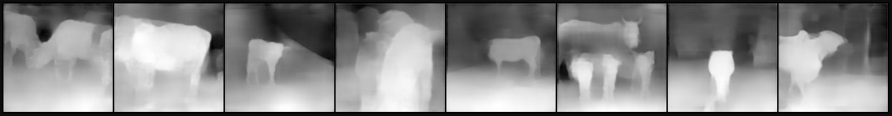

## Conclusions

The assignment task was successfully accomplised and results are promising. Below are some of the observations and future work.

1. Loss function has a great impact on performance. Just as in teaching if we give proper feedback to students they learn better, same is our model.
2. We do not have to un necessarily increase the capacity of a network. More capacity doesn't necessarily mean better
3. Pixel shuffle is good but that does not mean transpose convs need not be used anywhere. In fact in the [final model]((https://github.com/abhinavdayal/EVA4_LIBRARY/blob/master/EVA4/eva4models/s15netED.py), I observe that I am doing pixel shuffle too early. After concatenating the previous layer and skip connection input, I should first do some convs and then do pixel shuffle. However I thought of that later so could not try.
4. For grouped convs it may be good to use shuffleling like ShuffleNet. I did not use grouped convs but could have used in decoders in order to save some parameters
5. It may be better to have different decoder paths for mask and depth as both may have to learn different features from the encoded features. For sake of simplicity I did not do that. Even then this model worked well. 
6. The receptive field of our final model ranges from 108 to 314. Ideally there should be 4 levels as that is srtandard so I should be adding one more encoder level if I want to train on larger images.
7. There was no overfitting ever. The test loss was always lower than the train loss. In fact without augmentations also it was the case. Augmentations took extra time. Tried to use RAMDISK but got out of memory error so gave up on that.
