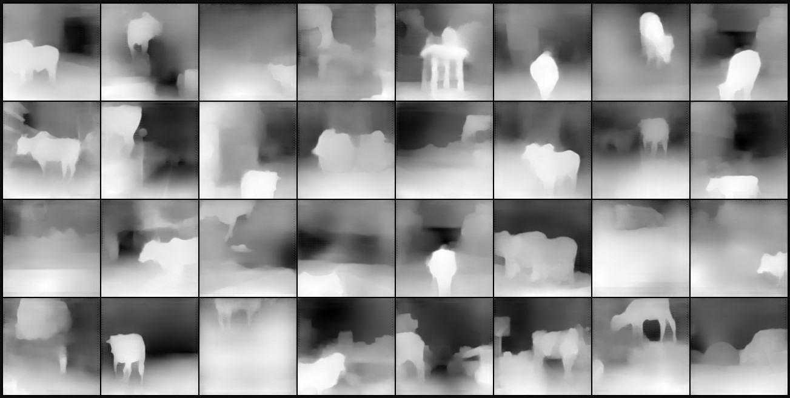
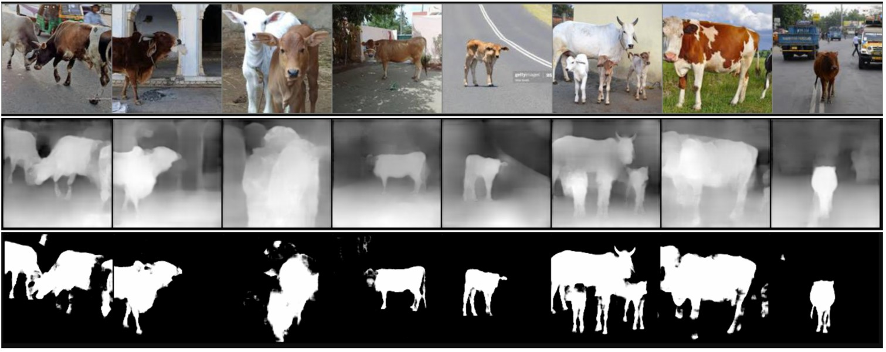

# S15 Assignment

I applied the following strategy in attempt to solve the assignment

1. **Create a DataSet and DataLoader for our new dataset**. The data loaded allows for image resizing and train test split.
2. **Use Tensorboard**. User a run builder based on [this post](https://hackernoon.com/how-to-structure-a-pytorch-ml-project-with-google-colab-and-tensorboard-7ram3agi) but uses tensorboard magic in colab instead of ngrok method.
3. **Separate Network from Loss criterion**. Separated the loss function from the Network definition in library, so loss functions can now be easily interchanged. Losses experimented with: L1, MSE, BCE, Dice, SSIM, MSSSIM and their combinations. [This paper] gave a good discussion and I also found combination of L1 and [MSSSIM](https://github.com/jorge-pessoa/pytorch-msssim/blob/master/pytorch_msssim/__init__.py) to work best. 
4. **Augmentations**: Added ability in dataset generator to apply transforms to both fgbg and intended outcome images. Used Blur, grayscale, rotate, horizontal flip, brightness contrast transforms and did not do cutouts as this is pixel level classification.
5. **LR Scheduler**: Used One Cycle Policy for initial training then cuyclic LR with triangular 2 policy.
6. **Network Architectures**: Since the output of out network must be of same size as input, there are two possibilities, parallel, or U (encoder/decoder) architectures. In order to keep parameter cout relatively low, I considered use of atrous convolutions and use of strides to increase receptive fields quicker. For decoder I tried both transpose convolutions and pixel shuffle. The UNet based architectures worked really well. I started very conservatively though in order to use as less parameters and to do faster trainings.

## First Experiment

**GOAL**: Intent was to keep the network really small and see what is working and what is not. At the same time challenge was to get enough receptive field and keep the output having same dimension as the input.

**NETWORK**: Started with [this](https://github.com/abhinavdayal/EVA4_LIBRARY/blob/master/EVA4/eva4models/s15net.py) network. It has around **230K parameters**. We trained on **32K images** and tested on **8K images** per epoch with a **batch size of 256**. It took around **3 minutes per epoch**. We used **L1 Loss with reduction of "sum"** instead of mean to avoid a division. **Learning rate was 0.0002** which I found with a simple LR finder over 3 epochs. **Receptive Field** is 120.

The loss came down from 300K to 230K and there were no signs of overfitting. Test loss was similar to train loss.


### INPUTS


### Outcomes

#### TRaining Loss


##### Test Loss


I found that the network had too much **checker board** issue and was not training that well so I updated it as below. I reduced amount of dilation in atrous convolutions and replaced transposed conv with pixel shuffle. The resulting netowrk improved further. Traned for 20 epochs with LR of 0.0002 and another 10 epochs with LR of 0.00002. Results can be seen below. The loss did not decrease beyond 125K though.

### Updated Network

I reduced dilation. **Receptive Field** is 120. Switched to pixel shuffle. Network has close to **730K parameters** and it can be found [here](https://github.com/abhinavdayal/EVA4_LIBRARY/blob/master/EVA4/eva4models/s15net2.py).


### Outcomes

#### TRaining Loss


#### Test Loss


#### Results 


### Doubling the Features?
Tried same network as above with double the number of channels in each layer, but the outcome was not even close. My guess is that increasing the channels confused the system as the data being passed is lowres. You need more input data to work with more channels. It is just like in a Logistic Regression, adding more features is not always helpful.

## Using MSELOSS with mean and not sum
This gave a lot better results after 35 epochs of training, beyond whch it did not show promise to train further as shown below. At this point I want to try some more loss functions before trying to modify our network (encoder decoder architectures, Resnet type variants etc.) and/or the way we create the imges (e.g. thresholding, quantization, etc.)

* [LINK to ipynb](https://github.com/abhinavdayal/DepthMask/blob/master/S15Assignment_attempt1.ipynb)
* [LINK to network code](https://raw.githubusercontent.com/abhinavdayal/EVA4_LIBRARY/master/EVA4/eva4models/s15net.py)


## USING SSIM Loss with window = 11 and reduction as mean
The depth calculation was much better. The MASKS however were almost blank images, so nothing to show. Notice how the checkerboard effect is gone and pixel shuffle is working way better with SSIM loss.

### Depth Output

### Depth Input


## Custom loss: using MSE for mask and SSIM for Depth

Till now I represented the problem as a reconstruction (regression) problem and for those these are the best losses. So why not use what worked well for each.

```
class CustomLoss(nn.Module):
    def __init__(self, maskloss, depthloss):
        super(CustomLoss, self).__init__()
        self.maskloss = maskloss
        self.depthloss = depthloss

    def forward(self, input, target):
        maskloss = self.maskloss(input[:,:1,:,:], target[:,:1,:,:])
        depthloss = self.depthloss(input[:,1:,:,:], target[:,1:,:,:])
        return maskloss + depthloss
```

Below, pink line indicates custom loss and blue indicates only SSIM. Both were trained for 20 epochs.


### LOSS VALUES

**Test loss at 10th EPOCH: .1549**

**Test loss at 20th EPOCH: .1312**


## DICE Loss for Mask and SSIM for Depth

DICE did not work so well for mask as shown below:


# Making residual blocks

I now added skip connections


After training on this for 10 epochs below is the loss stats


### Mask Outputs


### Depth Outputs


### LOSS VALUES

**Test loss at 10th EPOCH: .1355 (Without skip connections it was 0.1549)**

## Running on larger dataset

Ran for 4 epochs on the full dataset with the previous model (non resnet18) and got some decent results.
The loss reduced to 0.03x


# Encoder Decoder Archtecture with Resnet 18

The network is as shown below:


Outcomes with MSE loss for Mask and SSIM for Depth are shown below. There was no overfitting and test loss was consistently below train loss.


### LOSS VALUES

**Test loss at 10th EPOCH: .1131 (much better than 0.1355 value for previous network)**

# Augmentations
Tried few augmentations:
* blur
* random brightnesscontrast

To try any structural transform like rotate etc. I have to apply the same to mask and depth. So read about it and implemented that using Albumentations [here](https://github.com/abhinavdayal/EVA4_LIBRARY/blob/master/EVA4/eva4datasets/fgbgdata.py). Passing two list of transforms to dataset generator that will apply same transform from set1 to all images including mask and depth but only apply the second set of transforms to fgbg image. For example with blur, etc. we dont want to blur the mask and depth.

Below are sample augmentations
**NOTE**: I did not try cutouts etc. because this is a pixel level classification so every pixel is important. I model I can consider dropouts later if needed.


# Custom Encoder Decoder based on UNET concept
Reading literature and with group discussion I found that there is a lot of work on UNET based architectures in this domain. So it was worth trying. Few things I adjusted based on lessons learnt in classes:

1. So I used concatenation instead of addition
2. used 1x1 wherever I have to only change number of channels to concatenate to produce desired channels
3. Retained pixel shuffle for pixel shuffle however, later I realize that transpose conv may be better because I am not putting that much additional convs on the skip connections. Or I should have used additions instead. But good learning!


Trained for 10 epochs for 80x80 resolution with batch size of 192 that took 6 hours to complete. Then did 2 epochs on 160x160 size image that took another 4 hours to complete. The model had 2.3 million parameters overall. Results are below:

#### Depth Outputs

#### Depth Inputs

#### Mask Outputs

#### Mask Inputs

#### Learning rate and losses


## Trying on unseen data
I tried it on 8 images that were not in our test/train dataset at all and some of them were very different from our dataset. Our group copllected these images. Below are the results. Nice to see that the images that were like the training images we had worked well, but images there were different like the spotted cow etc. didnt work so well. Although if I improve the model some things should improve.




